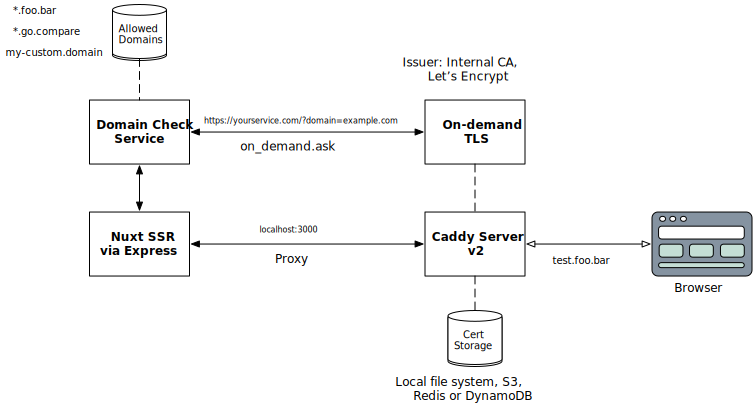

# Custom Domains with On-demand TLS
Example implementation of custom domains support with on-demand TLS (HTTPS) using Nuxt and Caddy.

- Caddy to provision on-demand TLS on wildcard domain/custom domain
- Nuxt middleware to detect domain forwarded by Caddy as host header

# Architecture

## High-level


## Application Level

# Running
Clone this repository and follow instructions below.

## Nuxt build setup

a. Install dependencies
```bash
yarn install
```

b. Serve with hot reload at localhost:3000
```bash
yarn dev
```

c. Build for production and launch server,
```bash
yarn build
yarn start
```

d. Generate static project
```bash
yarn generate
```

For detailed explanation on how things work, check out [Nuxt.js docs](https://nuxtjs.org).

## Run locally with wildcard domains

First lets get DNS `foo.bar`/`go.compare` mapped to localhost,

a. Install `dnsmasq`
```bash
brew install dnsmasq
```
b. Start dnsmasq service
```
sudo brew services start dnsmasq
```

c. Add following to the bottom of the /usr/local/etc/dnsmasq.conf

```
conf-dir=/usr/local/etc/dnsmasq.d,*.conf
```

d. Create our first config file
```
mkdir -p /usr/local/etc/dnsmasq.d
touch /usr/local/etc/dnsmasq.d/development.conf
nano /usr/local/etc/dnsmasq.d/development.conf
```

e. Add following in `development.conf`

```
address=/foo.bar/127.0.0.1
address=/go.compare/127.0.0.1
```

f. In `/etc/resolver` add new files `foo.bar`/`go.compare` with following content,

```
nameserver 127.0.0.1
```

g. Restart dnsmasq and check DNS

```
sudo brew services restart dnsmasq
scutil --dns
```


## Local Caddy setup

a. Install Redis for storage,
```bash
brew install redis
```

b. Install XCaddy,

```bash
cd server
export GO111MODULE=on
go get github.com/caddyserver/xcaddy/cmd/xcaddy@latest
xcaddy build v2.3.0 --with github.com/gamalan/caddy-tlsredis
```

c. Run Caddy Server
```
cd server
./caddy run --config CaddyfileLocal
```
